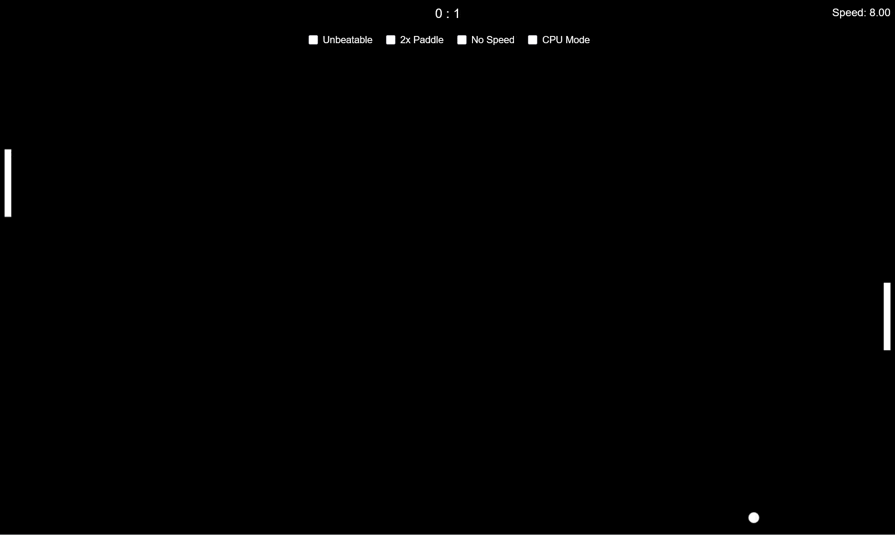

# Pong Game



A responsive, browser-based Pong clone featuring:

- **Player vs Computer**: Control your paddle; play against the CPU (with optional "Unbeatable" mode).
- **Adjustable Difficulty**: Enable "CPU Mode" for a fully automated match.
- **Dynamic Ball Speed**: Ball speed increases by 0.01 on each paddle hit (unless "No Speed" is enabled).
- **Power Ups** (max one per 2 minutes):
  - **Speed Up** (▲): +0.5 to ball speed
  - **Speed Down** (▼): –0.5 to ball speed (min 0.5)
  - **Double Paddle** (↻): Doubles the last‑hit paddle for 30 seconds
- **Optional Settings** (via tick boxes):
  - **Unbeatable**: CPU paddle never misses
  - **2× Paddle**: Both paddles are twice the height
  - **No Speed**: Disables incremental speed increases
  - **CPU Mode**: CPU controls both paddles
- **Spark Effects**: Particle sparks once ball speed ≥ 5
- **Score Tracking**: First to 5 points wins; displays "Player has won!" or "Computer has won!"
- **Responsive Design**: Works on desktop and mobile (touch and drag controls)
- **Live Speed Display**: Current ball speed shown on desktop

### [Live Demo Link (https://jmjspong.netlify.app/)](https://jmjspong.netlify.app/)

---

## Getting Started

1. **Clone or Download** this repository.
2. **Open** `pong_app.html` in any modern desktop or mobile browser.
3. **Press any key** (or tap) on the start overlay to begin the game.

## Controls

- **Desktop**

  - Arrow Up / Arrow Down: Move your paddle
  - Check/uncheck options: Toggle settings
  - Click ☰ on mobile to show options menu

- **Mobile**

  - Touch and drag on left side: Move your paddle
  - Tap start overlay to begin
  - Use the ☰ button to access options

## File Structure

```
pong_app.html    # Main game file (HTML, CSS, JS)
README.md        # This file
```

## Options & Settings

| Option     | Description                                              |
| ---------- | -------------------------------------------------------- |
| Unbeatable | CPU paddle will never miss the ball                      |
| 2× Paddle  | Both paddles instantly double their height               |
| No Speed   | Prevents the ball speed from increasing after collisions |
| CPU Mode   | Computer controls both paddles                           |

Power up types appear randomly (≤1 every 2 minutes) in the play area.

## Customisation

- Tweak `baseSpeed` in the `Ball` class for a faster or slower start.
- Modify spark count or lifetime in the `Spark` class for different effects.
- Adjust power‑up durations and spawn intervals in the script.

